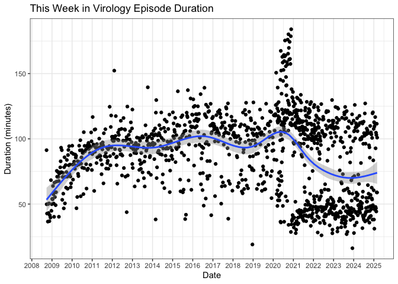
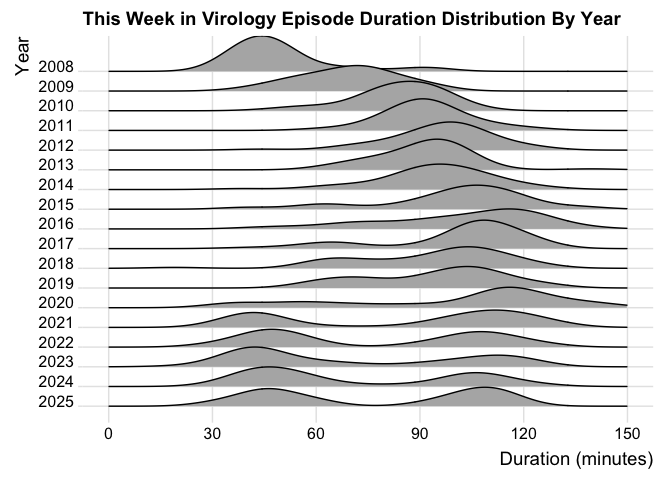
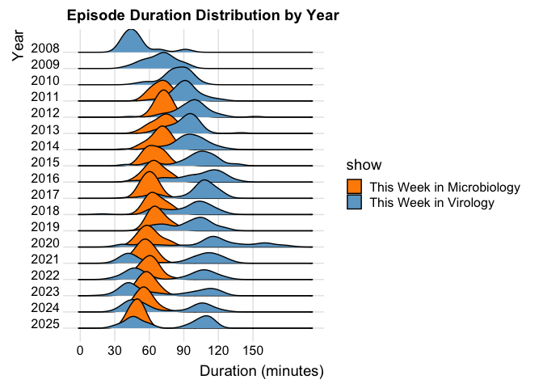
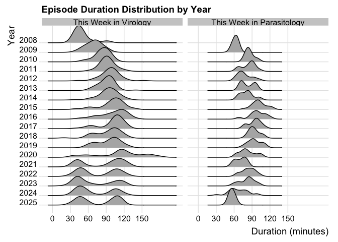
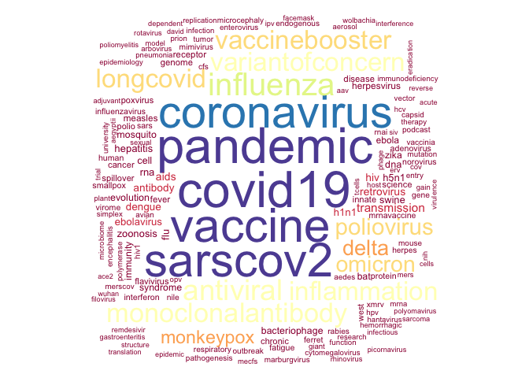

# Is TWiV getting longer?
Neil Saunders  
compiled `r Sys.time()`  

# Introduction
Is science podcast [This Week In Virology](http://www.microbe.tv/twiv/) getting longer? And some other TWiV trivia.

# Get the XML
Data for every podcast episode is contained in [the RSS feed](http://twiv.microbeworld.libsynpro.com/twiv). RSS is XML, so reading it into R is very easy. Details for each episode are found in the `item` nodes.

# Make the data frame
There is sure to be a clever and elegant way to map straight into a data frame using _e.g._ `purrr`. This is not that way.

- `pubDate` is converted to date-time
- `enclosure length` (bytes) is converted to numeric values
- `duration` is pre-pended with "00" where hours are absent, then converted to seconds as numeric values

The end result is a data frame with rows that look like this:

pubDate               title                                           encLength  duration    duration_seconds
--------------------  ---------------------------------------------  ----------  ---------  -----------------
2017-10-07 00:26:56   TWiV 462: Splicing RNA with Phillip A. Sharp     24164320  00:38:45                2325
2017-09-30 21:07:50   TWiV 461: Gotta trace them all!                  76767475  02:07:11                7631
2017-09-24 13:09:44   TWiV 460: Penn, a great sandbox for science      56187687  01:32:53                5573
2017-09-17 11:38:22   TWiV 459: Polio turns over a new leaf            63207573  01:44:35                6275
2017-09-09 20:27:02   TWiV 458: Saliva of the fittest                  71607507  01:58:35                7115

# Is TWiV getting longer?
Some time in 2016, I started to form the impression that most episodes of TWiV were around the two hour mark or more. Unfortunately, this prompted my decision to stop listening since I listen to several other podcasts and could not justify 2 hours each week for just one of them.

## Scatter plot
Let's start with a scatter plot.

There's a clear increase in duration for the first 4 years of the podcast, which then levels off. There's also quite a lot of noise due to "outliers": special episodes that tend to be much shorter than average.

<!-- -->

## Summarise by year
How about if we plot the mean episode duration by year?

Mean duration passed 90 minutes in 2011 and approached 100 minutes in 2015. There is a very slight decrease in the mean duration in the episodes aired so far for 2017.

<!-- -->

## Distribution of duration
The "ridge line" plot shows duration distributions by year.

This clearly shows the duration creeping towards two hours in 2016, but dropping back a little in 2017.

<!-- -->

# Conclusions
TWiV duration moved to around 90 minutes on average in 2010 - 2011, then moved again closer to 100 - 120 minutes in 2015 - 2016. However, the duration seems to have dropped back a little in 2017.

How about some of the other Microbe TV podcasts?

## This Week in Microbiology (TWiM)
<!-- -->

## This Week in Parasitism (TWiP)
<!-- -->

# Other ways to analyse the feed data
## Keywords
A word cloud of the podcast keywords. We remove stop words plus the words "virus", "viruses", "virology", "viral", "twiv".

Keywords occurring 10 or more times:
<!-- -->
